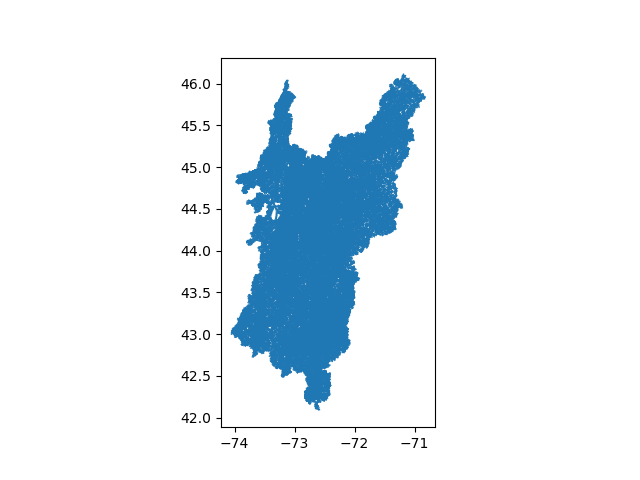

# nhd

* [NHD](https://www.usgs.gov/national-hydrography/nhdplus-high-resolution) 
  * The National Hydrography Dataset Plus High Resolution (NHDplus High Resolution) 
  maps the lakes, ponds, streams, rivers and other surface waters of the United States. 
  Created by the US Geological Survey, NHDPlus High Resolution provides mean annual flow and 
  velocity estimates for rivers and streams. 
  Additional attributes provide connections between features facilitating complicated analyses.
  * For more information on the NHDPlus High Resolution dataset see the User’s Guide for the National 
  * Hydrography Dataset Plus (NHDPlus) High Resolution.
  * [NHDPlus User's Guide](https://pubs.er.usgs.gov/publication/ofr20191096)
* Note – As of October 1, 2023, the NHD was retired. 
  NHD data will continue to be available, but no longer maintained. 
  The most current data will be available through the 3D Hydrography Program (3DHP)
* https://apps.nationalmap.gov/downloader/
  * Check this option -- Hydrography (NHDPlus HR, NHD, WBD)
  * Then check this option -- Subcategories -- Select All
  * And choose -- File Formats: shapefile
  * Data extent -- State
  * THEN: Click on "Search" and it takes you to a map where you can pick on a state
  * Once you select these options -- the download link for Vermont is the following...
  * https://prd-tnm.s3.amazonaws.com/StagedProducts/Hydrography/NHD/State/Shape/NHD_H_Vermont_State_Shape.zip
  * https://www.sciencebase.gov/catalog/item/61f8b8bcd34e622189c328d5
* Layer: Flowline - Large Scale (ID: 6)
  * ID: 460
  * Name: StreamRiver
  * These are the fields in the Shapefile
  ```
  Index(['permanent_', 'fdate', 'resolution', 'gnis_id', 'gnis_name', 'lengthkm',
         'reachcode', 'flowdir', 'wbarea_per', 'ftype', 'fcode', 'mainpath',
         'innetwork', 'visibility', 'SHAPE_Leng', 'ObjectID', 'geometry'],
  ```


